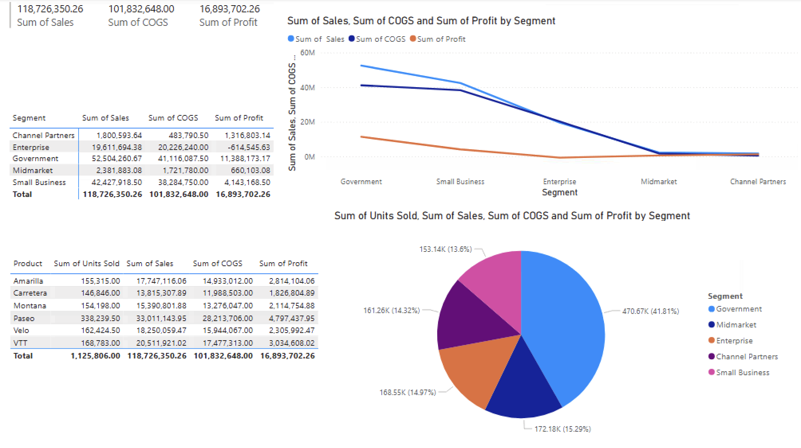
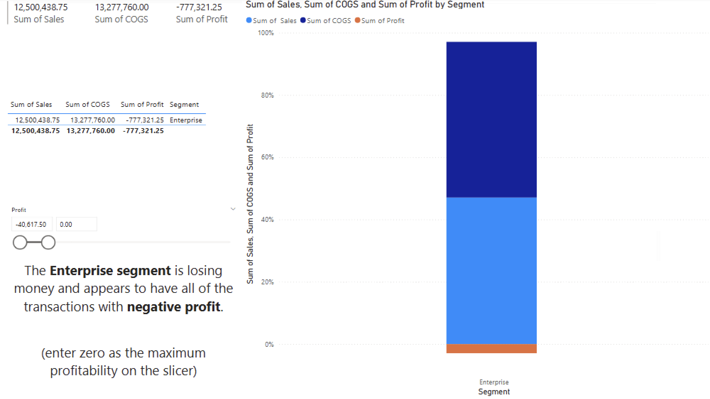

# Data Analytics Portfolio

## Project Overview
This repository showcases data analytics projects focused on transforming raw data into actionable business insights. Projects emphasize data cleaning, dashboard development, KPI tracking, and clear communication of findings to support decision-making.

## Tools Used
- Excel (advanced formulas, pivot tables, dashboards)
- Tableau and Power BI
- SQL (foundational)

## Focus Areas
- Data visualization and reporting
- Business and operational analytics
- Customer and performance analysis
- Trend identification and KPI monitoring

## Projects
### Sales Performance Analysis (Power BI)

**Objective:**  
Analyze sales, cost, and profit performance by customer segment to identify drivers of profitability and areas of risk.

**Key Insights:**
- The Enterprise segment generates high revenue but operates at a loss, indicating cost inefficiencies or pricing issues.
- Government and Small Business segments show healthier profit margins relative to sales volume.
- Segment-level analysis highlights opportunities for pricing, cost control, and sales strategy adjustments to improve overall profitability.
- A similar segmentation and KPI analysis approach was applied in a customer-facing environment at Restore Hyper Wellness, where existing dashboards and reports were used to support data-informed recommendations and sales decisions.

**Visuals:**
  

### Wildlife Strike Analysis (Power BI)

**Objective:**  
Analyze wildlife strike incidents to identify patterns in frequency, damage severity, and financial impact across time, location, and species.

**Key Insights:**
- Wildlife strikes occur most frequently during takeoff and landing phases, increasing operational risk near airports.
- Certain species groups contribute disproportionately to total damage costs despite lower strike frequency.
- Geographic and time-of-day patterns highlight opportunities for targeted risk mitigation strategies.

**Visuals:**
(Screenshots to be added)
